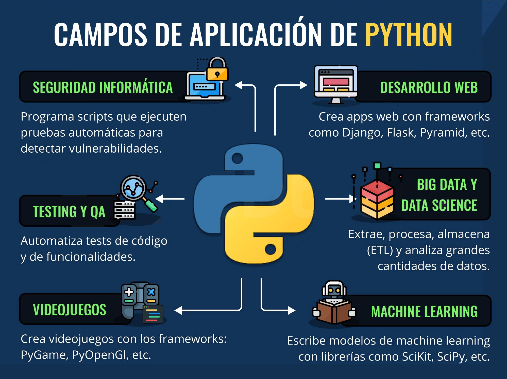

# Qué es Python

## * Python es un lenguaje interpretado
## * Fácil de utilizar
## * Es un Lenguaje Tipado Dinámicamente
## * Un lenguaje de alto nivel
## * Está orientado a objetos.

  
# Aplicaciones de Python

Referencias:

[Python para todos](https://www.google.com/url?sa=t&rct=j&q=&esrc=s&source=web&cd=&cad=rja&uact=8&ved=2ahUKEwiu_biW94n_AhUYE7kGHaimDjQQFnoECBsQAQ&url=https%3A%2F%2Fdo1.dr-chuck.com%2Fpythonlearn%2FES_es%2Fpythonlearn.pdf&usg=AOvVaw3uDNDq9LJxrBoChLHDS8cY)

[Python Programming for Beginners](https://z-lib.is/book/python-programming-for-beginners)

[Documentación Python](https://docs.python.org/3/tutorial/index.html)

[Tutorial Python](https://www.w3schools.com/python/python_strings.asp)