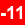
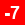
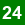

# 🧮 Código Python con Explicaciones en Markdown

## **1. Lista de Números Impares**
```python
impares = [1, 3, 5, 7, 9, 11, 13, 15, 17, 19]
print(impares)
```
###  Índices de la Lista
| Valor           | 1   | 3   | 5   | 7   | | 11  | 13  | 15  | 17  | 19  |
|-----------------|-----|-----|-----|-----|-----|-----|-----|-----|-----|-----|
| **Índice Positivo** | 0   | 1   | 2   | 3   || 5   | 6   | 7   | 8   | 9   |
| **Índice Negativo** |     | -9  | -8  | -7  | -6  | -5  | -4  | -3  | -2  | -1  |

---

### **Explicación:**
1. **Valor**: Representa los elementos de la lista `[1, 3, 5, 7, 9, 11, 13, 15, 17, 19]`.
2. **Índice Positivo**: Muestra los índices positivos (de `0` a `9`) para acceder a los elementos desde el inicio de la lista.
3. **Índice Negativo**: Muestra los índices negativos (de `-1` a `-9`) para acceder a los elementos desde el final de la lista.

## **3. Acceso a Elementos de la Lista**

```Python
# Mostar valore
print(impares[4])  # Mpstrara el numero 9
print(impares[-6])
print(impares[:4])
print(impares[4:])
```
### **Explicación:**
1. Se accede a elementos específicos de la lista usando índices positivos y negativos.
2. Se utilizan rebanadas (`slicing`) para obtener subconjuntos de la lista.

## **4. Mostrar Rangos de la Lista**
```python
# Mostrar rango
print(impares[3:7])
print(impares[-7:-3])

# No devuelve nada por el orden
print(impares[-3:-7]) 
```
### **Explicación:**
1. Se pueden obtener rangos de la lista usando índices positivos y negativos.
2. Si el rango está en orden inverso, no se devuelve nada.

## **5. Unión de Listas**
```python
pares = [2, 4, 6, 8, 10]
union = impares + pares 
print (union)
```

## **6. Adicion de valor a la lista**
```python
pares.append(12)
print (pares)
```
## **7. Reemplazar Valores en la Lista**
```python
print (impares)
impares[4:7] = [21, 23, 25]
print (impares)
```
## **8. Métodos de Listas**
```python
# Métodos
alfa_numerico = [1, 'a', 3, 'b', 5, 'a', 7, 'a', 'b']
print(alfa_numerico)

print(alfa_numerico.index('a'))  # Muestra la posición de la primera ocurrencia de 'a'
print(alfa_numerico.count('a'))  # Cuenta cuántas veces aparece 'a' en la lista

# Eliminar el último valor
print(alfa_numerico)
alfa_numerico.pop(5)  # Elimina el valor en la posición 5
print(alfa_numerico)

# Eliminar el primer valor que se encuentre
print(alfa_numerico)
alfa_numerico.remove('b')  # Elimina la primera ocurrencia de 'b'
print(alfa_numerico)

# Eliminar un rango de posiciones
print(alfa_numerico)
del alfa_numerico[2:6]  # Elimina los valores desde la posición 2 hasta la 5
print(alfa_numerico)

# Invertir la lista
print(alfa_numerico)
alfa_numerico.reverse()  # Invierte el orden de la lista
print(alfa_numerico)

# Ordenar
desordenado = [2, 5, 6, 9, 8, 4, 5, 2]
desordenado.sort()  # Ordena la lista de menor a mayor
print(desordenado)
```
## **9. Manipulación de Cadenas**

| Carácter       | |  |  |  |  | _   |  |  |  |  | _   | p   | y   | t   | h   | o   | n   |
|----------------|-----|-----|-----|-----|-----|-----|-----|-----|-----|-----|-----|-----|-----|-----|-----|-----|-----|
| **word[:5]**   |  | 1   | 2   | 3   |  |  | 6   | 7   | 8   | 9   | 10  | 11  | 12  | 13  | 14  | 15  | 16  |
| **word[6:10]** | 0   | 1   | 2   | 3   | 4   | 5   |  | 7   | 8   |  |  | 11  | 12  | 13  | 14  | 15  | 16  |
| **Índice Negativo** |     | -16 | -15 | -14 | -13 | -12 |  | -10 | -9  |   |  | -6  | -5  | -4  | -3  | -2  | -1  |

```python
word = 'Hello_from_python'
print(word)

print(word[:5])   # primeros 5 caracteres (Hello)
print(word[6:10]) # caracteres desde la posición 6 hasta la 9 (from)
print(word[-11:-7]) # caracteres desde la posición -11 hasta la -7 (from)
```

## **10. Matrices**

|       | 0   | 1   |  | 3   | 4   |
|-------|-----|-----|--------------------|-----|-----|
| **0** | 10  | 12  | 14                 | 16  | 18  |
|  | 20  | 22  |  | 26  | 28  |

```python
matriz = [ 
    [10, 12, 14, 16, 18], 
    [20, 22, 24, 26, 28] 
]

print(matriz[1][2])  # Muestra el valor 24 (fila 1, columna 2)
```
