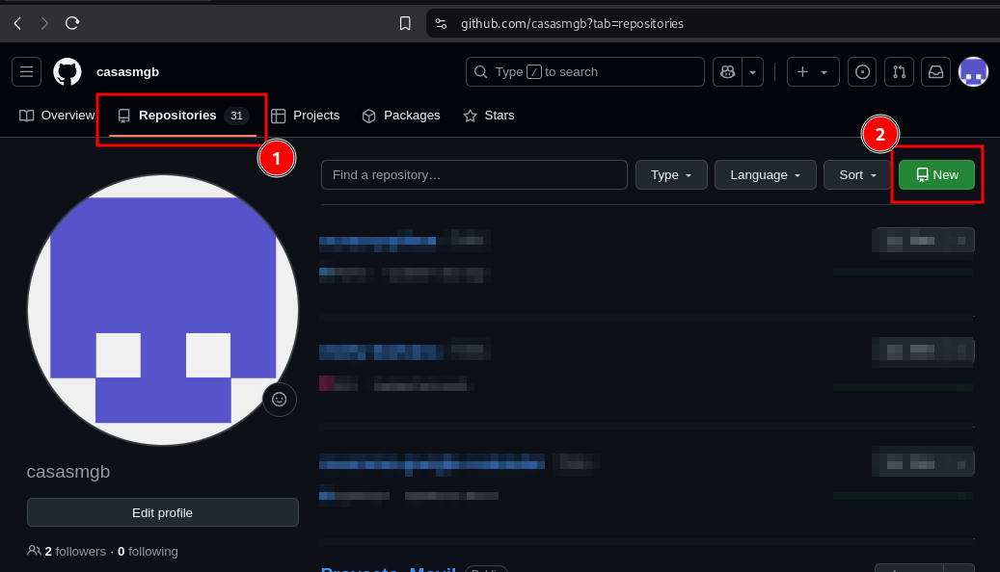
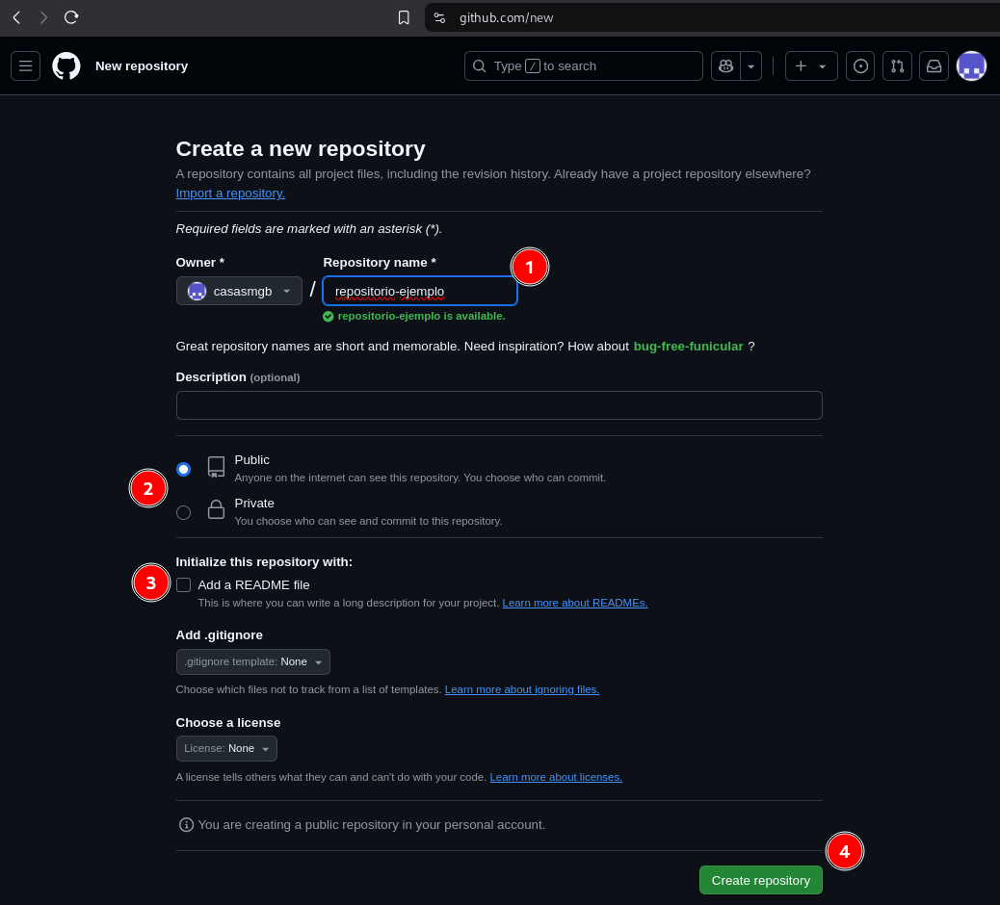
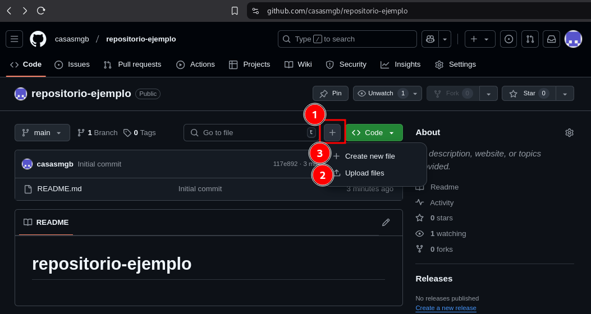
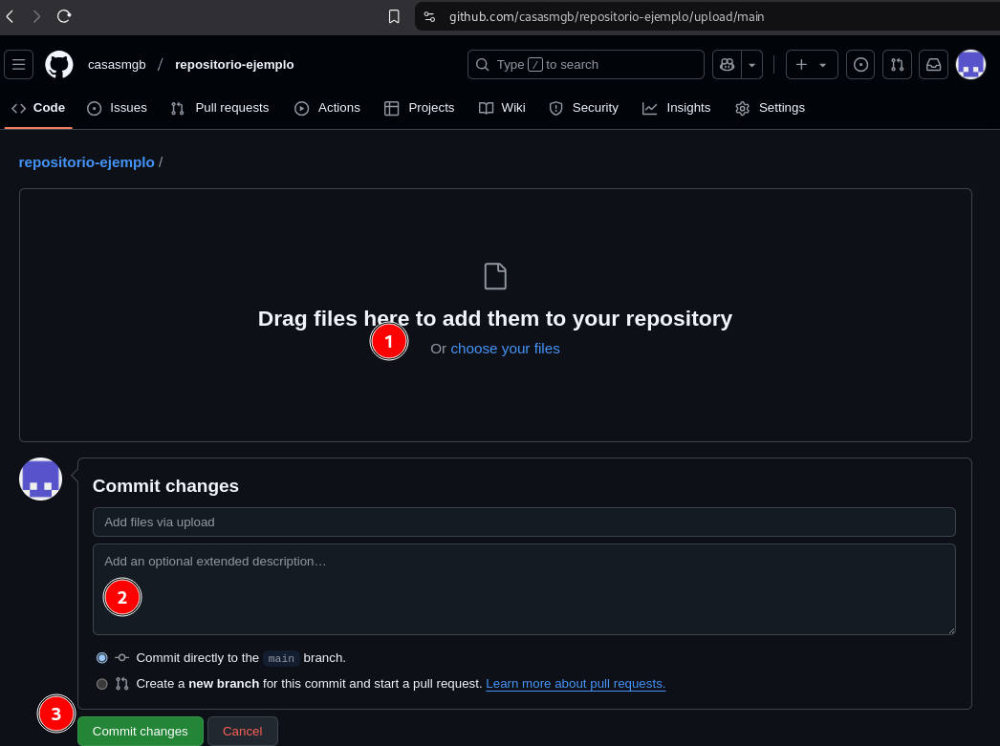
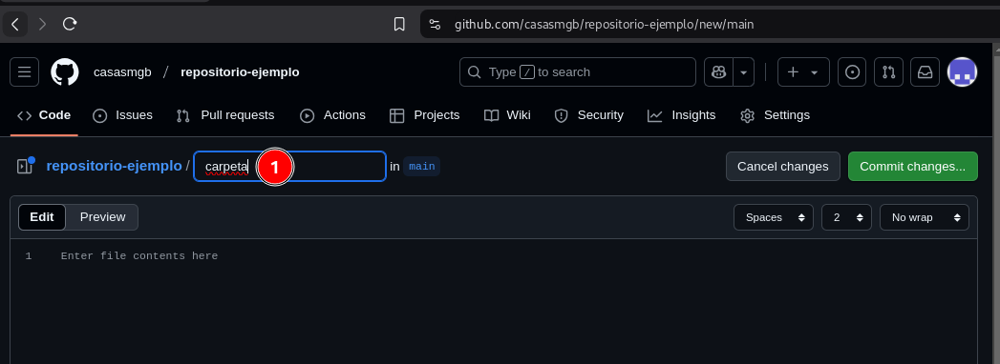
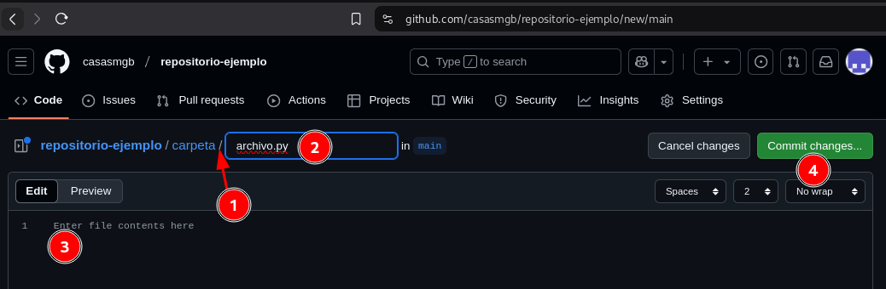

# Manual de uso GitHub :octocat:

Este manual es para sbir archivos a GITHUB desde su aplicacion web.

## 1. Requisitos Previos :gear:

Antes de comenzar, asegúrate de tener lo siguiente:

- :key: Una cuenta en [GitHub](https://github.com). 

### Crear un nuevo repositorio
- **Paso 1:** seleccionar la pestaña de **Repositorios**
- **Paso 2:** seleccionar el botón **Nuevo**

- **Paso 1:** Introducir el nombre del nuevo repositorio
- **Paso 2:** Definir el alcance de la publicación
- **Paso 3:** Marcar la creación del archivo **README**
- **Paso 4:** Crear el repositorio.

### Crear un archivo

- **Paso 1:** Para agregar archivos seleccione el botón con el signo `+`
- **Paso 2:** Esta **opción 1** Permite subir uno o más archivos.
- **Paso 3:** Esta **opción 2** Permite crear carpetas o archivos.

#### Opcion 1 para subida de archivo

- **Paso 1:** Sección para seleccionar o arrastrar el archivo que se va a subir.
- **Paso 2:** Agregar un comentario relacionado al contenido del archivo.
- **Paso 3:** Confirmar los cambios para que se registre.

#### Opcion 2 para crear carpetas y/o archivos

- **Paso 1:** para la creación de carpetas escribir el nombre de la carpeta.

- **Paso 1:** después del nombre de la carpeta agregar un signo slash `/` par indicar que es una carpeta, se puedes agregar varios `/` para definir mas carpetas
- **Paso 2:** Luego definir el nombre del archivo que se creara en la carpeta.
- **Paso 3:** En esta sección se puede pegar el contenido del archivo.

**Nota.-** En github no se puede crear carpetas vacias directamente, este debe tener necesariamente archivos.
por loq ue este paso se debe hacer por lo menos para un archivo para los demas archivos de la carpeta se puede usar la opcion de **subida de archivos**
